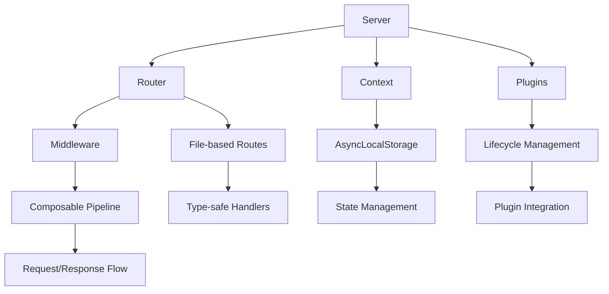

# 🚀 BlaizeJS Core

> A blazing-fast, type-safe Node.js framework with file-based routing, powerful middleware, and end-to-end type safety

[](https://badge.fury.io/js/blaizejs)
[](https://opensource.org/licenses/MIT)
[](https://www.typescriptlang.org/)

## 📋 Table of Contents

- [🌟 Features](#-features)
- [📦 Installation](#-installation)
- [🚀 Quick Start](#-quick-start)
- [🏗️ Architecture Overview](#️-architecture-overview)
- [📁 Project Structure](#-project-structure)
- [🌐 Production Deployment](#-production-deployment)
- [🔗 Framework Modules](#-framework-modules)
- [🧩 Plugin Ecosystem](#-plugin-ecosystem)
- [📡 Type-Safe Client](#-type-safe-client)
- [✅ Testing](#-testing)
- [🤝 Contributing](#-contributing)
- [🗺️ Roadmap](#️-roadmap)

## 🌟 Features

- ⚡ **Blazing Fast Performance** - HTTP/2 by default with HTTP/1.1 fallback
- 🔒 **End-to-End Type Safety** - Full TypeScript support from API to client
- 📁 **File-Based Routing** - Intuitive routing based on file structure
- 🔗 **Powerful Middleware System** - Composable middleware with onion-style execution
- 🧩 **Plugin Architecture** - Extensible with lifecycle management
- 🌐 **Context Management** - AsyncLocalStorage for automatic context propagation
- 🔄 **Hot Reloading** - Instant development feedback
- 🛡️ **Schema Validation** - Built-in Zod integration for request/response validation
- 🔗 **Client Generation** - Automatic type-safe API client generation
- 🚀 **Production Ready** - Graceful shutdown, error handling, and monitoring

## 📦 Installation

```bash
# Using pnpm (recommended)
pnpm add blaizejs

# Using npm
npm install blaizejs

# Using yarn
yarn add blaizejs
```

### 📋 Requirements

- **Node.js**: >= 22.0.0 (LTS recommended)
- **TypeScript**: >= 5.8.3 (for development)
- **Package Manager**: pnpm 9.7.0+ (recommended)

## 🚀 Quick Start

### 🎯 Create Your First Server

```typescript
import { createServer } from 'blaizejs';
import { fileURLToPath } from 'node:url';
import path from 'node:path';

// Required for ESM module path resolution
const __filename = fileURLToPath(import.meta.url);
const __dirname = path.dirname(__filename);

// Create server with automatic routing
const server = createServer({
  routesDir: path.resolve(__dirname, './routes'),
});

await server.listen();
console.log('🚀 Server running on https://localhost:3000');
```

### 📁 Create Your First Route

```typescript
// routes/users.ts
import { createGetRoute, createPostRoute } from 'blaizejs';
import { z } from 'zod';

// GET /users - List users with type safety
export const getUsers = createGetRoute({
  schema: {
    query: z.object({
      limit: z.coerce.number().min(1).max(100).default(10),
      search: z.string().optional(),
    }),
    response: z.object({
      users: z.array(
        z.object({
          id: z.string(),
          name: z.string(),
          email: z.string(),
        })
      ),
      total: z.number(),
    }),
  },
  handler: async ctx => {
    // Query params are automatically typed and validated
    const { limit, search } = ctx.request.query;

    const users = await findUsers({ limit, search });
    return { users, total: users.length };
  },
});

// POST /users - Create user with validation
export const createUser = createPostRoute({
  schema: {
    body: z.object({
      name: z.string().min(1),
      email: z.string().email(),
    }),
    response: z.object({
      id: z.string(),
      name: z.string(),
      email: z.string(),
      createdAt: z.string(),
    }),
  },
  handler: async ctx => {
    // Request body is automatically validated
    const userData = ctx.request.body;

    const user = await createNewUser(userData);
    return user;
  },
});
```

### 🔗 Add Middleware

```typescript
import { createServer, createMiddleware } from 'blaizejs';
import { fileURLToPath } from 'node:url';
import path from 'node:path';

const __filename = fileURLToPath(import.meta.url);
const __dirname = path.dirname(__filename);

// Create logging middleware
const logger = createMiddleware({
  name: 'logger',
  handler: async (ctx, next) => {
    const start = Date.now();
    console.log(`→ ${ctx.request.method} ${ctx.request.path}`);

    await next();

    const duration = Date.now() - start;
    console.log(`← ${ctx.response.raw.statusCode} (${duration}ms)`);
  },
});

// Create server with middleware
const server = createServer({
  routesDir: path.resolve(__dirname, './routes'),
  middleware: [logger],
});

await server.listen();
```

## 🏗️ Architecture Overview

BlaizeJS is built around five core modules that work together seamlessly:



### 🔄 Request Lifecycle

1. **Server** receives HTTP request
2. **Context** creates request/response wrappers with AsyncLocalStorage
3. **Router** matches request to file-based route
4. **Middleware** executes in onion-style pattern
5. **Route Handler** processes request with full type safety
6. **Context** sends validated response

## 📁 Project Structure

### 🎯 Recommended Structure

```
my-blaize-app/
├── src/
│   ├── server.ts           # Server entry point
│   ├── app-routes.ts       # Route registry for blaize client
│   ├── routes/             # File-based routes
│   │   ├── index.ts        # → /
│   │   ├── users.ts        # → /users
│   │   ├── users/
│   │   │   └── [id].ts     # → /users/:id
│   │   └── api/
│   │       └── v1/
│   │           └── posts.ts # → /api/v1/posts
│   ├── middleware/         # Custom middleware
│   ├── plugins/            # Custom plugins
│   └── types/              # Shared types
├── tests/                  # Test files
├── package.json
└── tsconfig.json
```

### 📊 Module Responsibilities

| Module         | Purpose                   | Key Features               |
| -------------- | ------------------------- | -------------------------- |
| **Server**     | HTTP server management    | HTTP/2, SSL, lifecycle     |
| **Router**     | Request routing           | File-based, type-safe      |
| **Context**    | Request/response handling | AsyncLocalStorage, state   |
| **Middleware** | Request processing        | Composable, error handling |
| **Plugins**    | Framework extension       | Lifecycle, validation      |

## 🌐 Production Deployment

### ⚠️ HTTP/2 Hosting Limitations

BlaizeJS defaults to HTTP/2 for optimal performance, but many hosting providers don't expose SSL certificate access required for HTTP/2:

```typescript
// Production configuration for hosting providers
const server = createServer({
  routesDir: path.resolve(__dirname, './routes'),
  http2: {
    // Disable HTTP/2 if certificates aren't accessible
    enabled: process.env.HTTP2_ENABLED === 'true',
  },
});
```

### 🔧 Hosting Provider Configurations

```typescript
// Vercel/Netlify (HTTP/1.1 only)
const server = createServer({
  port: parseInt(process.env.PORT || '3000'),
  routesDir: path.resolve(__dirname, './routes'),
  http2: { enabled: false },
});

// VPS/Dedicated (HTTP/2 with Let's Encrypt)
const server = createServer({
  port: 443,
  host: '0.0.0.0',
  routesDir: path.resolve(__dirname, './routes'),
  http2: {
    enabled: true,
    keyFile: '/etc/letsencrypt/live/yourdomain.com/privkey.pem',
    certFile: '/etc/letsencrypt/live/yourdomain.com/fullchain.pem',
  },
});

// Docker Container
const server = createServer({
  port: parseInt(process.env.PORT || '3000'),
  host: '0.0.0.0',
  routesDir: path.resolve(__dirname, './routes'),
  http2: {
    enabled: process.env.SSL_CERT_PATH && process.env.SSL_KEY_PATH,
    keyFile: process.env.SSL_KEY_PATH,
    certFile: process.env.SSL_CERT_PATH,
  },
});
```

### 🚀 Environment Configuration

```typescript
// Environment-aware server setup
const getServerConfig = () => {
  const env = process.env.NODE_ENV || 'development';

  switch (env) {
    case 'development':
      return {
        port: 3000,
        routesDir: path.resolve(__dirname, './routes'),
        http2: { enabled: true }, // Auto-generates certs
      };

    case 'production':
      return {
        port: parseInt(process.env.PORT || '443'),
        host: '0.0.0.0',
        routesDir: path.resolve(__dirname, './dist/routes'),
        http2: {
          enabled: !!process.env.SSL_CERT_PATH,
          keyFile: process.env.SSL_KEY_PATH,
          certFile: process.env.SSL_CERT_PATH,
        },
      };

    case 'test':
      return {
        port: 0,
        routesDir: path.resolve(__dirname, './test-fixtures/routes'),
        http2: { enabled: false },
      };
  }
};

const server = createServer(getServerConfig());
```

> **🔄 HTTP/2 Workaround:** We're actively working on solutions for HTTP/2 deployment in constrained hosting environments. Follow our roadmap for updates.

## 🔗 Framework Modules

### 🌐 Server Module

High-performance HTTP/2 server with graceful lifecycle management.

```typescript
import { createServer } from 'blaizejs';

const server = createServer({
  port: 3000,
  routesDir: './routes',
  http2: { enabled: true },
});

// Event-driven lifecycle
server.events.on('started', () => console.log('Server ready'));
server.events.on('stopping', () => console.log('Graceful shutdown'));

await server.listen();
```

[📖 Server Module Documentation](./src/server/README.md)

### 🚀 Router Module

File-based routing with automatic path generation and type safety.

```typescript
import { createGetRoute } from 'blaizejs';
import { z } from 'zod';

// routes/posts/[id].ts → GET /posts/:id
export const getPost = createGetRoute({
  schema: {
    params: z.object({ id: z.string().uuid() }),
    response: z.object({
      id: z.string(),
      title: z.string(),
      content: z.string(),
    }),
  },
  handler: async (ctx, params) => {
    return await findPost(params.id);
  },
});
```

[📖 Router Module Documentation](./src/router/README.md)

### 🔗 Context Module

Request/response context with AsyncLocalStorage integration.

```typescript
import { getCurrentContext, setState, getState } from 'blaizejs';

export const handler = async () => {
  const ctx = getCurrentContext(); // Available anywhere

  // Request data
  const userAgent = ctx.request.header('user-agent');
  const body = ctx.request.body;

  // State management
  setState('userId', '123');
  const userId = getState<string>('userId');

  // Response
  return ctx.response.json({ success: true });
};
```

[📖 Context Module Documentation](./src/context/README.md)

### 🔗 Middleware Module

Composable middleware with onion-style execution.

```typescript
import { createMiddleware, compose } from 'blaizejs';

const auth = createMiddleware({
  name: 'auth',
  handler: async (ctx, next) => {
    // Pre-processing
    const token = ctx.request.header('authorization');
    if (!token) return ctx.response.status(401).json({ error: 'Unauthorized' });

    await next();

    // Post-processing
    ctx.response.header('X-Authenticated', 'true');
  },
});

// Compose multiple middleware
const apiMiddleware = compose([cors, auth, rateLimit]);
```

[📖 Middleware Module Documentation](./src/middleware/README.md)

### 🧩 Plugins Module

Extensible plugin system with lifecycle management.

```typescript
import { createPlugin } from 'blaizejs';

const databasePlugin = createPlugin(
  'database',
  '1.0.0',
  async (server, options) => {
    let db: Database;

    return {
      initialize: async () => {
        db = await connectToDatabase(options.connectionString);
        server.context.setGlobal('db', db);
      },
      terminate: async () => {
        await db.close();
      },
    };
  },
  { connectionString: 'mongodb://localhost:27017/app' }
);

const server = createServer({
  routesDir: './routes',
  plugins: [databasePlugin()],
});
```

[📖 Plugins Module Documentation](./src/plugins/README.md)

## 🧩 Plugin Ecosystem

### 🏗️ Official Plugins

| Plugin                        | Purpose                        | Status         |
| ----------------------------- | ------------------------------ | -------------- |
| `@blaizejs/auth-plugin`       | Authentication & authorization | 🔄 Coming Soon |
| `@blaizejs/database-plugin`   | Database integration           | 🔄 Coming Soon |
| `@blaizejs/cache-plugin`      | Caching strategies             | 🔄 Coming Soon |
| `@blaizejs/validation-plugin` | Enhanced validation            | 🔄 Coming Soon |
| `@blaizejs/monitoring-plugin` | Metrics & observability        | 🔄 Coming Soon |

### 🛠️ Creating Custom Plugins

```typescript
import { createPlugin } from 'blaizejs';

export const myPlugin = createPlugin(
  'my-plugin',
  '1.0.0',
  (server, options) => {
    // Add middleware
    server.use(
      createMiddleware({
        name: 'my-middleware',
        handler: async (ctx, next) => {
          // Plugin logic
          await next();
        },
      })
    );

    // Add routes
    server.router.addRoute('GET', '/plugin-route', {
      handler: () => ({ message: 'From plugin' }),
    });
  },
  {
    /* default options */
  }
);
```

## 📡 Type-Safe Client

BlaizeJS provides seamless client generation with the `@blaizejs/client` package for consuming your APIs with full type safety:

### 📦 Client Installation

```bash
# Install the client package
pnpm add @blaizejs/client
```

### 🎯 Export Your Routes

First, export your routes from your server for client consumption:

```typescript
// routes/hello.ts
import { createGetRoute, createPostRoute } from 'blaizejs';
import { z } from 'zod';

export const getHello = createGetRoute({
  schema: {
    query: z.object({
      name: z.string().optional(),
    }),
    response: z.object({
      message: z.string(),
      timestamp: z.string(),
    }),
  },
  handler: async ctx => {
    const { name } = ctx.request.query;
    return {
      message: `Hello ${name || 'World'}!`,
      timestamp: new Date().toISOString(),
    };
  },
});

export const postHello = createPostRoute({
  schema: {
    body: z.object({
      message: z.string(),
    }),
    response: z.object({
      id: z.string(),
      echo: z.string(),
    }),
  },
  handler: async ctx => {
    const { message } = ctx.request.body;
    return {
      id: crypto.randomUUID(),
      echo: message,
    };
  },
});
```

```typescript
// app-routes.ts - Export all your routes
import { getHello, postHello } from './routes/hello.js';

export const routes = {
  getHello,
  postHello,
} as const;
```

### 🔗 Create Type-Safe Client

```typescript
// client.ts
import { createClient } from '@blaizejs/client';
import { routes } from './app-routes.js';

// Create client with full type safety
const client = createClient('http://localhost:3000', routes);

// Fully typed API calls with method grouping
const helloData = await client.$get.getHello({
  query: { name: 'TypeScript' }, // Typed and validated
});

console.log(helloData.message); // Type: string
console.log(helloData.timestamp); // Type: string

// POST request with body validation
const postData = await client.$post.postHello({
  body: { message: 'Hello from client!' }, // Typed and validated
});

console.log(postData.id); // Type: string
console.log(postData.echo); // Type: string
```

### 🎛️ Client Configuration

```typescript
import { createClient } from '@blaizejs/client';
import type { ClientConfig } from '@blaizejs/types';

// Advanced client configuration
const config: ClientConfig = {
  baseUrl: 'https://api.example.com',
  defaultHeaders: {
    Authorization: 'Bearer your-token',
    'User-Agent': 'MyApp/1.0.0',
  },
  timeout: 10000,
};

const client = createClient(config, routes);

// All requests will use the configured headers and timeout
const data = await client.$get.getHello();
```

### 🔍 Client Method Structure

The client organizes methods by HTTP verb using the `$method` pattern:

```typescript
// Available client methods
client.$get.routeName(); // GET requests
client.$post.routeName(); // POST requests
client.$put.routeName(); // PUT requests
client.$delete.routeName(); // DELETE requests
client.$patch.routeName(); // PATCH requests
client.$head.routeName(); // HEAD requests
client.$options.routeName(); // OPTIONS requests
```

**Key Client Features:**

- 🔒 **Full Type Safety** - Automatically inferred from your route schemas
- ✅ **Request Validation** - Client-side validation before sending requests
- 📊 **Response Validation** - Runtime validation of API responses
- 🎯 **IntelliSense Support** - Complete autocomplete for all routes and parameters
- 🔄 **Error Handling** - Typed error responses with detailed validation messages
- ⚡ **Lightweight** - Minimal runtime overhead with proxy-based implementation

[📖 Client Package Documentation](https://github.com/jleajones/blaize/tree/main/packages/blaize-client#readme)

## ✅ Testing

### 🧪 Framework Testing Tools

BlaizeJS provides comprehensive testing utilities:

```typescript
import { describe, test, expect } from 'vitest';
import { createTestContext } from '@blaizejs/testing-utils';
import { getUsers } from '../routes/users';

describe('Users API', () => {
  test('should return paginated users', async () => {
    const ctx = createTestContext({
      method: 'GET',
      path: '/users',
      query: { limit: '5', offset: '0' },
    });

    const result = await getUsers.handler(ctx, {});

    expect(result).toEqual({
      users: expect.arrayContaining([
        expect.objectContaining({
          id: expect.any(String),
          name: expect.any(String),
          email: expect.any(String),
        }),
      ]),
      total: expect.any(Number),
    });
  });
});
```

### 🔧 Testing Configuration

```json
{
  "scripts": {
    "test": "vitest run",
    "test:watch": "vitest",
    "test:coverage": "vitest run --coverage"
  }
}
```

### 🏃‍♂️ Running Tests

```bash
# Run all tests
pnpm test

# Watch mode
pnpm test:watch

# Coverage report
pnpm test:coverage

# Test specific modules
pnpm test server
pnpm test router
pnpm test middleware
```

## 🤝 Contributing

We welcome contributions to BlaizeJS! Please see our [Contributing Guide](../../CONTRIBUTING.md) for details.

### 🛠️ Development Setup

```bash
# Clone the repository
git clone https://github.com/jleajones/blaize.git
cd blaize

# Install dependencies (uses pnpm workspaces)
pnpm install

# Run tests
pnpm test

# Start development
pnpm dev

# Build all packages
pnpm build
```

### 🏗️ Monorepo Structure

```
blaize/
├── packages/
│   ├── blaizejs/           # Core framework (this package)
│   ├── client/             # Type-safe client generator
│   ├── types/              # Shared TypeScript types
│   ├── testing-utils/      # Testing utilities
│   └── configs/            # Shared configurations
├── plugins/                # Official plugins
├── apps/                   # Example applications
└── docs/                   # Documentation
```

### 📝 Code Standards

- ✅ **TypeScript**: Strict mode enabled for all packages
- ✅ **Testing**: Comprehensive test coverage with Vitest
- ✅ **Linting**: ESLint with consistent configuration
- ✅ **Formatting**: Prettier for code formatting
- ✅ **Commits**: Conventional commits for clear history
- ✅ **Documentation**: JSDoc comments for public APIs

### 🔧 Available Scripts

```bash
pnpm build          # Build all packages
pnpm dev            # Start development mode
pnpm lint           # Run ESLint across packages
pnpm format         # Format code with Prettier
pnpm type-check     # Run TypeScript checks
pnpm clean          # Clean all build artifacts
pnpm changeset      # Create changeset for versioning
```

### 🧪 Testing Guidelines

When contributing to the core framework:

- ✅ Test all HTTP/2 and HTTP/1.1 compatibility
- ✅ Test ESM module resolution and path handling
- ✅ Test AsyncLocalStorage context propagation
- ✅ Test middleware composition and error handling
- ✅ Test plugin lifecycle management
- ✅ Include integration tests with real HTTP requests
- ✅ Test production deployment scenarios
- ✅ Test type safety and schema validation

### 🎯 Architecture Guidelines

Key principles for core framework development:

- 🔒 **Type Safety First** - Everything should be typed and validated
- ⚡ **Performance** - Minimal overhead and optimal execution
- 🧩 **Modularity** - Clean separation between modules
- 🔄 **Async/Await** - Modern async patterns throughout
- 🛡️ **Error Handling** - Comprehensive error management
- 📖 **Documentation** - Clear examples and API docs

## 🗺️ Roadmap

### 🚀 Current (v0.1.x)

- ✅ **HTTP/2 Server** with HTTP/1.1 fallback and SSL support
- ✅ **File-Based Routing** with automatic path generation and hot reloading
- ✅ **Type-Safe Routes** with Zod schema validation and route creators
- ✅ **Composable Middleware** with onion execution and error handling
- ✅ **Plugin System** with lifecycle management and validation
- ✅ **Context Management** with AsyncLocalStorage and state isolation
- ✅ **Testing Utilities** with comprehensive test helpers
- ✅ **ESM Support** with proper module resolution
- ✅ **Client Generation** with full type safety (separate package)

### 🎯 Next Release (v0.2.x)

- 🔄 **HTTP/2 Hosting Solutions** - Workarounds for hosting provider limitations
- 🔄 **Performance Optimizations** - Radix tree improvements and caching
- 🔄 **Advanced Schema Validation** - Enhanced Zod integration and custom validators
- 🔄 **Built-in Monitoring** - Performance metrics and health checks
- 🔄 **Route Groups** - Organized routing with shared middleware
- 🔄 **Plugin Registry** - Centralized plugin discovery and management

### 🔮 Future (v0.3.x+)

- 🔄 **GraphQL Integration** - File-based GraphQL resolvers
- 🔄 **WebSocket Support** - Real-time endpoints with type safety
- 🔄 **Server-Side Streaming** - Streaming responses and SSE
- 🔄 **Edge Runtime** - Deployment to edge computing platforms
- 🔄 **Zero-Config Deployment** - One-command deployment to various platforms
- 🔄 **Advanced Caching** - Multi-layer caching strategies

### 🌟 Long-term Vision

- 🔄 **Visual Development** - GUI tools for route and middleware management
- 🔄 **AI-Powered Optimization** - Automatic performance tuning and suggestions
- 🔄 **Multi-Protocol Support** - gRPC, WebSocket, and HTTP/3 in unified framework
- 🔄 **Microservices Platform** - Service mesh integration and distributed systems
- 🔄 **Enterprise Features** - Advanced security, compliance, and governance

---

## 📚 Related Documentation

- 🌐 [Server Module](./src/server/README.md) - HTTP server creation and lifecycle management
- 🚀 [Router Module](./src/router/README.md) - File-based routing and type-safe handlers
- 🔗 [Context Module](./src/context/README.md) - Request/response context and state management
- 🔗 [Middleware Module](./src/middleware/README.md) - Composable middleware system
- 🧩 [Plugins Module](./src/plugins/README.md) - Plugin architecture and lifecycle
- 🔗 [Client Package](./src/client/README.md) - Type-safe API client generation
- 🧪 [Testing Utils](./src/testing-utils/README.md) - Testing utilities and helpers

---

**Built with ❤️ by the BlaizeJS team**

For questions, feature requests, or bug reports, please [open an issue](https://github.com/jleajones/blaize/issues) on GitHub.
